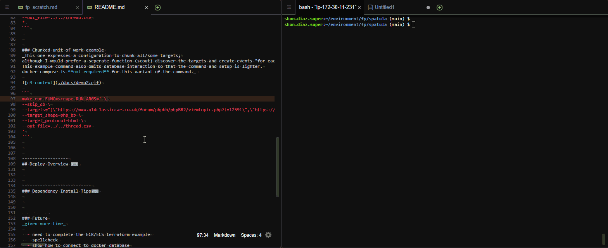
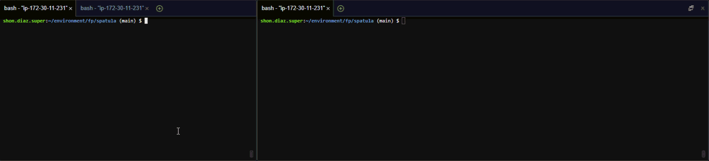

# Spatula
_A scraping system. Named by Lori Diaz whilst watching Great British Bake-off._

# Table of Contents

* [C4 Diagrams](#c4-diagrams)
* [System Requirements](#system-requirements)
* [Unit Test Overview](#unit-test-overview)
* [Running Local](#running-local)
* [Deploy Overview](#deploy-overview)


--------------


## C4 Diagrams

### Context
_The high level view of this system._


------------------------------------

### Container
_We've zoomed into the dark blue "Spatula" box from the previous "context" diagram._


----------------------------------------

### Container _(Scoped)_
_The scope of this code-challenge._


------------------------------------------------------


## System Requirements
_Since this code challenge is scoped down, 
docker and localstack represent a method of complex local dependency mocking.
These are especially useful for localized integration testing.
An example will be provided that utilizes a complex dependency (database), but is not required._

- Ubuntu 18.x
  - _Tested on Mojave 10.14.2 as well_
- pipenv
  - _the apple install sequence will also install pyenv_
- docker _(optional)_
- docker-compose _(optional)_


#### Love Windows or RedHat for development?
_See Story 123 Sprint N for implementation. Future command `make pain`._


## Unit Test Overview
_Before_ running unit tests, ensure that the proper system requirements are met with `make install`.

Unit tests may be invoked with `make test`.
These commands should work locally or within a wired up CI/CD solution.
Unit tests are idempotent and deterministic; notifying us when logic alterations break strict expectations.
```
make test
make lint
```


## Running Local
_There are two scenarios for local runs._  
_Scenario 1: Simple file export_  
_Scenario 2: Complex dependency requirements_  

In general, 
Calling `make run` will rebuild the `FUNC` script in the `.build/` directory, 
and execute the `main.py` with any provided run arguments.
_(This is done in preparation of a deployment strategy where this code may be reused homogeneously as a lambda, docker container, or local script as seen here.)_

Before running locally, ensure that the proper system requirements are met.
```
make install
make test
```


### Chunked unit of work example _(Scenario 1)_
_This one expresses a configuration to chunk all/some targets;
although I would prefer a seperate function (scout) discover the targets and create events "for-each-viable" in order to properly isolate concerns.
This example command also omits database interaction so that the command and setup is lighter.
docker-compose is **not required** for this variant of the command._



```
make run FUNC=scrape RUN_ARGS=' \
--skip_db \
--targets="[\"https://www.oldclassiccar.co.uk/forum/phpbb/phpBB2/viewtopic.php?t=12591\",\"https://www.oldclassiccar.co.uk/forum/phpbb/phpBB2/viewtopic.php?t=12591&postdays=0&postorder=asc&start=15\",\"https://www.oldclassiccar.co.uk/forum/phpbb/phpBB2/viewtopic.php?t=12591&postdays=0&postorder=asc&start=30\",\"https://www.oldclassiccar.co.uk/forum/phpbb/phpBB2/viewtopic.php?t=12591&postdays=0&postorder=asc&start=45\",\"https://www.oldclassiccar.co.uk/forum/phpbb/phpBB2/viewtopic.php?t=12591&postdays=0&postorder=asc&start=60\",\"https://www.oldclassiccar.co.uk/forum/phpbb/phpBB2/viewtopic.php?t=12591&postdays=0&postorder=asc&start=75\",\"https://www.oldclassiccar.co.uk/forum/phpbb/phpBB2/viewtopic.php?t=12591&postdays=0&postorder=asc&start=90\",\"https://www.oldclassiccar.co.uk/forum/phpbb/phpBB2/viewtopic.php?t=12591&postdays=0&postorder=asc&start=105\",\"https://www.oldclassiccar.co.uk/forum/phpbb/phpBB2/viewtopic.php?t=12591&postdays=0&postorder=asc&start=120\"]" \
--target_shape=php_bb \
--target_protocol=html \
--out_file=../../thread.csv
'
```


### Single unit of work example _(Scenario 2)_
_Note that this command **requires a database to be up**.
Sane parameters are already specified below.
`make shim` stands up the complex dependencies for you.
If you wish for just the code-challenge minimum requirements,
see the example ["Chunked unit of work example"](#chunked-unit-of-work-example-scenario-1)._



`terminal A`
```
make shim
```

`terminal B`
```
make run FUNC=scrape RUN_ARGS=' \
--raw_bucket=raw-data \
--s3_endpoint=http://localhost:4572 \
--db_host=127.0.0.1 \
--db_port=13306 \
--db_name=optimal \
--db_user=root \
--db_pass=password \
--targets="[\"https://www.oldclassiccar.co.uk/forum/phpbb/phpBB2/viewtopic.php?t=12591\"]" \
--target_shape=php_bb \
--target_protocol=html \
--out_file=../../thread.csv
'
```


------------------
## Deploy Overview 
_(Not implemented, will be done in sprint X story SPAT-4567)_
Manual deploys are possible directly from the command line if the appropriate permissions are configured.

```
export AWS_ACCESS_KEY_ID=AAAAAAAABBBBBBBCCCCCC
export AWS_SECRET_ACCESS_KEY=******************************
export AWS_DEFAULT_REGION=us-west-2

export TF_VAR_rds_user=bot
export TF_VAR_rds_pass=password
```

```
make build deploy TARGET=role ENV=lab
make build deploy TARGET=network ENV=lab
make build deploy TARGET=aurora ENV=lab
make build deploy TARGET=ecs ENV=lab
```

These commands can be easily wired up to a CI/CD pipeline.
The builds and deploys can be triggered by events specified by the team _(on push, on merge to master, on tag, etc)_.


---------------------------
### Dependency Install Tips
_For the purposes of the code-challenge, I have created a swift set of commands to get this up and running on an ubuntu 18 machine.
Apple and/or windows support is not available at this time (though it may possibly work on apple's bash out of the box)._

docker-compose
```
sudo curl -L "https://github.com/docker/compose/releases/download/1.22.0/docker-compose-$(uname -s)-$(uname -m)"  -o /usr/local/bin/docker-compose \
&& sudo mv /usr/local/bin/docker-compose /usr/bin/docker-compose \
&& sudo chmod +x /usr/bin/docker-compose

make install
make shim
```


----------
### Future
_given more time_

  - need to complete the ECR/ECS terraform example
  - spellcheck
  - show how to connect to docker database
  - show how to connect to the rds behind vpc
    - likely jump host
  - complete IaC as shows in diagram
  - complete the docker build and deploy
  - flesh out a better db schema after examininig other sources.
  - try to integrate pylint with pytest instead of standalone
  - optimize build scripts
  - support full context injection _(i rushed this and the context itself is therefore not easily testable)_
  - implement retry _(in infra, not code)_
  - move out local lib into a repository manager _(like nexus)_
    - especially the `transform.py` which could be a lib for all parsing business logic
  - use typing consistently
  - implement a real logging solution
  - fill out comment docs more
  - error handling
  - check Makefile compatibility with local apple/windows _(I only dev on ubuntu these days for python)_
  - abstract serializer to support various output types _(json, yml, csv, etc)_
  - way more unit tests for all the `src/lib/`
  - implement snapshots for some tests with large comparisons
  - deal with pytest warnings
  - more obvious ready-state for successfully run `make shim`
    - currently when done, it just waits and logs activity, no setup confirm message.
  - fix the terminal demo.gif recording resolution
  - deal with encoding on unit test differences with runtime
    - harmless warning that clogs the log output needs to be dealt with


----------------------------
### Rendered Scan of results

